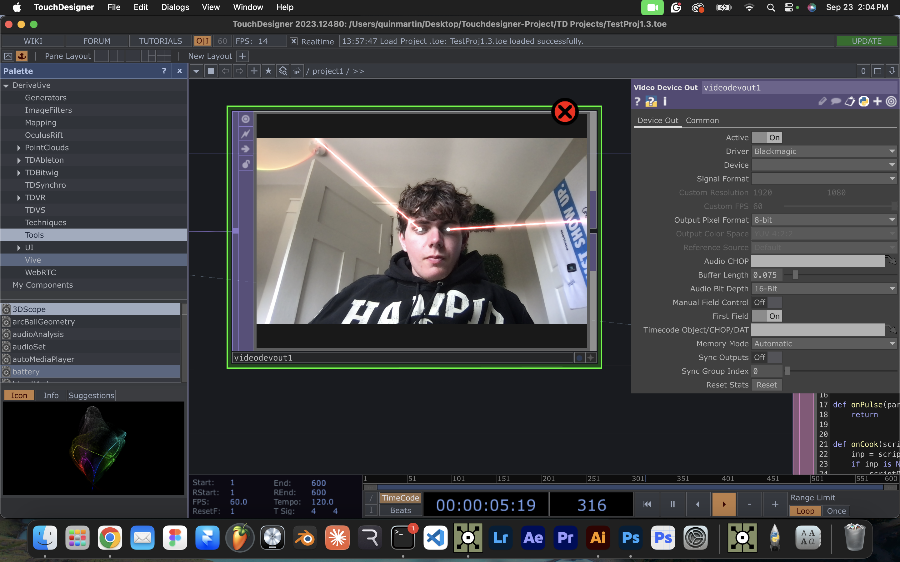

# this is my build log

- 09/09/2026: I started this project

- 09/20/2026: I didn't exactly do the homework correct last week - I though we were just supposed to make sure TD was up and running, not actually try something in there. Therefor, I will be doing this weeks AND last weeks hw. I will be connecting Claude to TD (which I've never worked with an MCP before) and creating my first project in TD. I will also start brainstorming ideas of what I want to make for the full project. This is my entry before I get started for the day (and to make sure I remember how to push into Github), so here we go.

- this is a line of text I added using Claude Code - yay

- 09/20/2026: Figured out how to use Claude Code in my terminal and getting pretty comfortable using it. I kind of hate the fact that I am using AI to do all this work for me, but it is pretty cool learning what it can do. I am currently downloading the Node install so that I can connect an MCP to TD, hopefully it will be done downloading after the Chiefs game so I can try some stuff out. I added a Concepts.md file for my recent homework, and excited to talk these over and try some stuff out. If all goes good with this project, I might be able to sell this to some sports teams! This might be it for today (depending on when this thing downloads) but we'll see if I get back to it

- 09/21/2026: today I connected Claude to Touchdesigner and made my first mini project. I made it shoot lazers out of my eyes (even though it doesn't work great) It keeps regestering my nostrails as eyeballs and there's lazers shooting everywhere. Happy that it worked though

